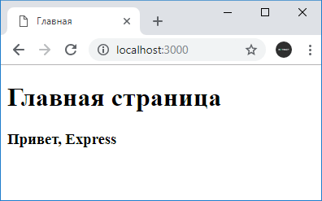
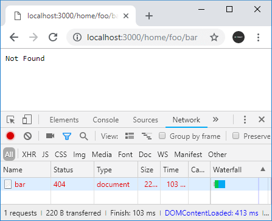

# Отправка ответа

Для отправки ответа в express у объекта response можно использовать ряд функций. Самый распространенный способ отправки ответа представляет функция `send()`. В качестве параметра эта функция может принимать объект `Buffer`, строку, в том числе с html-кодом, объект javascript или массив.

```js
const express = require('express')
const app = express()

app.use(function (request, response) {
  response.send('<h2>Hello</h2>')
})

app.listen(3000)
```

Отправка объекта:

```js
response.send({ id: 6, name: 'Tom' })
```

Отправка массива:

```js
response.send(['Tom', 'Bob', 'Sam'])
```

Отправка объекта:

```js
response.send(Buffer.from('Hello Express'))
```

Объект `Buffer` формально представляет некоторые бинарные данные. Так, в случае выше при выполнении кода по умолчанию браузер загрузит файл, в котором будет строка `Hello Express`.

## sendFile

Метод `send` удобен для отправки строк, некоторого кода html небольшой длины, однако есть отправляемый код html довольно большой, то соответственно код приложения тоже становится громоздким. Например, мы можем написать так:

```js
const express = require('express')
const app = express()

app.use(function (request, response) {
  response.send(`<!DOCTYPE html>
  <html>
  <head>
      <title>Главная</title>
      <meta charset="utf-8" />
  </head>
  <body>
      <h1>Главная страница</h1>
      <h3>Привет, Express</h3>
  </body>
  <html>`)
})

app.listen(3000)
```



Однако гораздо лучше определять код html в отдельных файлах и затем эти файлы отправлять с помощью функции `sendFile()`.

Например, определим в папке проекта новый файл `index.html`:

```html
<!DOCTYPE html>
<html>
  <head>
    <title>Главная</title>
    <meta charset="utf-8" />
  </head>
  <body>
    <h1>Главная страница</h1>
    <h3>Привет, Express</h3>
  </body>
  <html></html>
</html>
```

Отправим этот файл с помощью функции `sendFile`:

```js
const express = require('express')
const app = express()

app.use(function (request, response) {
  response.sendFile(__dirname + '/index.html')
})

app.listen(3000)
```

В итоге мы получим тот же самый результат.

Следует учитывать, что в функцию `sendFile` необходимо передавать абсолютный путь к файлу, именно для этого с помощью `__dirname` получаем абсолютный путь к текущему проекту и затем добавляем к нему путь к файлу в рамках текущего проекта.

## Отправка статусных кодов

Функция `sendStatus()` отправляет пользователю определенный статусный код с некоторым сообщением по умолчанию. Например, отправим статусный код `404`, который говорит, что ресурс не найден:

```js
const express = require('express')
const app = express()

app.use('/home/foo/bar', function (request, response) {
  response.sendStatus(404)
})

app.listen(3000)
```



Как видно из скриншота, при отправке статусного кода `404` также отправляется сообщение `Not Found`. Но, возможно, мы захотим отправлять какие-то свои более информативные сообщения. В этом случае можно использовать комбинацию функции `status()`, которая также отправляет статусный код, и функции `send()`:

```js
const express = require('express')
const app = express()

app.use('/home/foo/bar', function (request, response) {
  response.status(404).send(`Ресурс не найден`)
})

app.listen(3000)
```
