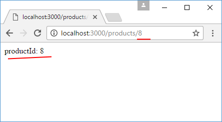
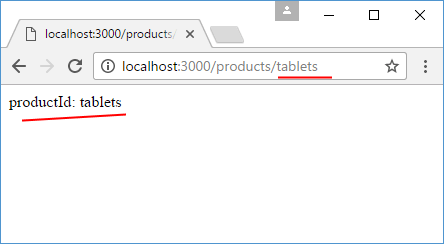
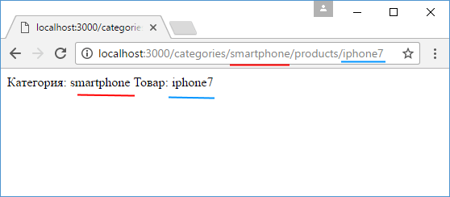
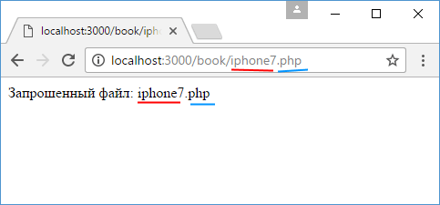

# Параметры маршрута

Параметры маршрута представляют именованные сегменты URL-адреса. Не стоит их путать с параметрами строки запроса. Например:

```
localhost:3000/about/user?id=3&name=Tome
```

Здесь параметры строки запроса - это то, что идет после вопросительного знака - `id=3&name=Tome`. Остальная часть, которая идет до вопросительного знака может содержать параметры маршрута.

Название параметра должно включать символы из диапазона `[A-Za-z0-9_]`. В определении маршрута параметры предваряются знаком двоеточия:

```js
const express = require('express')
const app = express()

app.get('/products/:productId', function (
  request,
  response
) {
  response.send('productId: ' + request.params['productId'])
})

app.listen(3000)
```

В данном случае параметр называется `productId`. Через коллекцию `request.params` можно получить все параметры и, в частности, значение параметра `productId`.

Если нам потребуется передать для этого параметра значение, то оно указывается в качестве последнего сегмента в строке запроса:





Мы можем использовать более сложные комбинации параметров:

```js
app.get(
  '/categories/:categoryId/products/:productId',
  function (request, response) {
    let catId = request.params['categoryId']
    let prodId = request.params['productId']
    response.send(`Категория: ${catId}  Товар: ${prodId}`)
  }
)
```



Или к примеру:

```js
app.get('/book/:pageName.:pageExt', function (
  request,
  response
) {
  let pageName = request.params['pageName']
  let pageExt = request.params['pageExt']
  response.send(`Запрошенный файл: ${pageName}.${pageExt}`)
})
```


