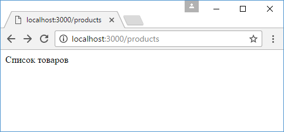
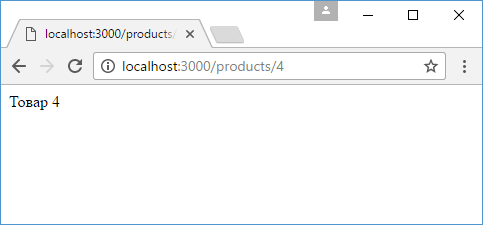

# Router

**Router** позволяет определить дочерние подмаршруты со своими обработчиками относительно некоторого главного маршрута. Например, определим следующее приложение:

```js
const express = require('express')
const app = express()

app.use('/about', function (request, response) {
  response.send('О сайте')
})

app.use('/products/create', function (request, response) {
  response.send('Добавление товара')
})
app.use('/products/:id', function (request, response) {
  response.send(`Товар ${request.params.id}`)
})
app.use('/products/', function (request, response) {
  response.send('Список товаров')
})

app.use('/', function (request, response) {
  response.send('Главная страница')
})
app.listen(3000)
```

Здесь у нас есть пять маршрутов, которые обрабатываются различными обработчиками. Но три из этих маршрутов начинаются с `/products` и условно относятся к некоторому функционалу по работе с товарами (просмотр списка товаров, просмотр одного товара по `id` и добавление товара). Объект `Router` позволяет связать подобный функционал в одно целое и упростить управление им. Например, перепишем предыдущий пример с использованием объекта `Router`:

```js
const express = require('express')
const app = express()

// определяем Router
const productRouter = express.Router()

// определяем маршруты и их обработчики внутри роутера
productRouter.use('/create', function (request, response) {
  response.send('Добавление товара')
})
productRouter.use('/:id', function (request, response) {
  response.send(`Товар ${request.params.id}`)
})
productRouter.use('/', function (request, response) {
  response.send('Список товаров')
})
// сопотавляем роутер с конечной точкой "/products"
app.use('/products', productRouter)

app.use('/about', function (request, response) {
  response.send('О сайте')
})

app.use('/', function (request, response) {
  response.send('Главная страница')
})
app.listen(3000)
```

Здесь определен объект `productRouter`, который обрабатывает все запросы по маршруту `/products`. Это главный маршрут. Однако в рамках этого маршрута может быть подмаршрут `/` со своим обработчиком, а также подмаршруты `/:id` и `/create`, которые также имеют свои обработчики.




