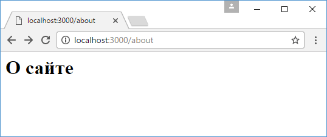

# Статические файлы

Рассмотрим, как в Node.js + Express отправлять пользователю статические файлы html. Для работы со статическими файлами в Express определен специальный компонент `express.static()`, который указывает на каталог с файлами.

Создадим для статических файлов в проекте каталог `public`, в который добавим новую html-страницу, которую назовем `about.html`:

```html
<!DOCTYPE html>
<html>
  <head>
    <title>О сайте</title>
    <meta charset="utf-8" />
  </head>
  <body>
    <h1>О сайте</h1>
  </body>
  <html></html>
</html>
```

В итоге проект будет выглядеть следующим образом:

- `app.js`
- `node_modules`
- `package.json`
- `public`
  - `about.html`

Теперь изменим файл `app.js`:

```js
const express = require('express')

const app = express()

app.use(express.static(__dirname + '/public'))

app.use('/', function (request, response) {
  response.send('<h1>Главная страница</h1>')
})

app.listen(3000)
```

Чтобы встроить компонент `express.static` в процесс обработки запроса, вызывается функция `app.use()`. Эта функция позволяет добавлять различные компоненты, которые еще называются middleware, в конвейер обработки запроса:

```js
app.use(express.static(__dirname + '/public'))
```

Причем данный вызов помещается до всех остальных вызовов функции `app.get()`.

В саму же функцию `express.static()` передается путь к папке со статическими файлами. Специальное выражение `__dirname` позволяет получить полный путь к папке.

Запустим приложение на выполнение и обратимся в браузере по пути `http://localhost:3000/about.html`:



Следует отметить, что для обращения к файлу мы указываем только имя файла без названия каталога `public`. Также не следует путать подобное обращение к файлам с действием функции `sendFile`: в данном случае мы напрямую обращаемся к статическим файлам, а функция `sendFile` фактически берет содержимое из файла и отсылает его пользователю.

Дополнительно мы можем изменить путь к каталогу статических файлов:

```js
const express = require('express')

const app = express()

app.use('/static', express.static(__dirname + '/public'))

app.use('/', function (request, response) {
  response.send('<h1>Главная страница</h1>')
})

app.listen(3000)
```

Теперь чтобы обратиться к файлу `about.html`, необходимо отправить запрос `http://localhost:3000/static/about.html`.
