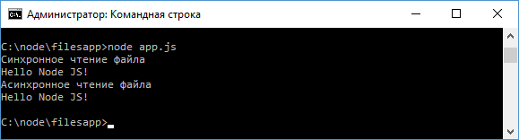
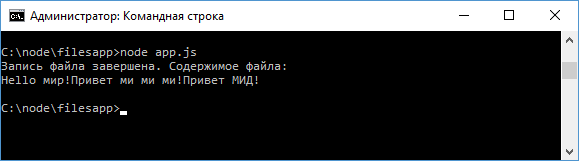

# Работа с файлами

Для работы с файлами в Node.js предназначен модуль [`fs`](https://nodejs.org/api/fs.html). Рассмотрим, как с ним работать.

## Чтение из файла

Допустим, в одной папке с файлом приложения `app.js` расположен текстовый файл `hello.txt` с простейшим текстом, например:

```
Hello Node JS!
```

Для чтения файла в синхронном варианте применяется функция `fs.readFileSync()`:

```
let fileContent = fs.readFileSync("hello.txt", "utf8");
```

В метод передается путь к файлу относительно файла приложения `app.js`, а в качестве второго параметра указывается кодировка для получения текстового содержимого файла. На выходе получаем считанный текст.

Для асинхронного чтения файла применяется функция `fs.readFile`:

```
fs.readFile("hello.txt", "utf8", function(error,data){ });
```

Первый и второй параметр функции опять же соответственно путь к файлу и кодировка. А в качестве третьего параметра передается функция обратного вызова, которая выполняется после завершения чтения. Первый параметр этой функции хранит информацию об ошибке при наличии, а второй - собственно считанные данные.

Для чтения файла определим в файле `app.js` следующий код:

```js
const fs = require('fs')

// асинхронное чтение
fs.readFile('hello.txt', 'utf8', function (error, data) {
  console.log('Асинхронное чтение файла')
  if (error) throw error // если возникла ошибка
  console.log(data) // выводим считанные данные
})

// синхронное чтение
console.log('Синхронное чтение файла')
let fileContent = fs.readFileSync('hello.txt', 'utf8')
console.log(fileContent)
```



И здесь стоит обратить внимание, что несмотря на то, что функция `fs.readFile()` вызывается первой, но так как она асинхронная, она не блокирует поток выполнения, поэтому ее результат выводится в самом конце.

## Запись файла

Для записи файла в синхронном варианте используется функция `fs.writeFileSync()`, которая в качестве параметра принимает путь к файлу и записываемые данные:

```js
fs.writeFileSync('hello.txt', 'Привет ми ми ми!')
```

Также для записи файла можно использовать асинхронную функцию `fs.writeFile()`, которая принимает те же параметры:

```js
fs.writeFile('hello.txt', 'Привет МИГ-29!')
```

В качестве вспомогательного параметра в функцию может передаваться функция обратного вызова, которая выполняется после завершения записи:

```js
const fs = require('fs')

fs.writeFile('hello.txt', 'Hello мир!', function (error) {
  if (error) throw error // если возникла ошибка
  console.log(
    'Асинхронная запись файла завершена. Содержимое файла:'
  )
  let data = fs.readFileSync('hello.txt', 'utf8')
  console.log(data) // выводим считанные данные
})
```


Следует отметить, что эти методы полностью перезаписывают файл. Если надо дозаписать файл, то применяются методы `fs.appendFile()`/`fs.appendFileSync()`:

```js
const fs = require('fs')

fs.appendFileSync('hello.txt', 'Привет ми ми ми!')

fs.appendFile('hello.txt', 'Привет МИД!', function (error) {
  if (error) throw error // если возникла ошибка

  console.log('Запись файла завершена. Содержимое файла:')
  let data = fs.readFileSync('hello.txt', 'utf8')
  console.log(data) // выводим считанные данные
})
```



## Удаление файла

Для удаления файла в синхронном варианте используется функция `fs.unlinkSync()`, которая в качестве параметра принимает путь к удаляемому файлу:

```js
fs.unlinkSync('hello.txt')
```

Также для удаления файла можно использовать асинхронную функцию `fs.unlink()`, которая принимает путь к файлу и функцию, вызываемую при завершении удаления:

```js
fs.unlink('hello.txt', (err) => {
  if (err) console.log(err)
  // если возникла ошибка
  else console.log('hello.txt was deleted')
})
```
