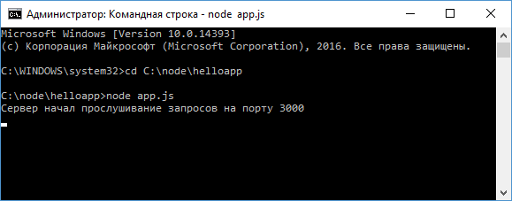
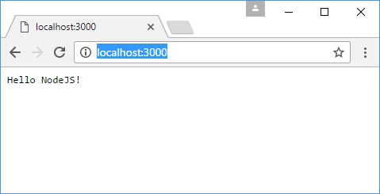

# Первое приложение на Node.js

Напишем первое простейшее приложение для NodeJS. Для создания приложений можно использовать практически все стандартные конструкции языка JavaScript. Исключением является работа с DOM, так как приложение будет запускаться на сервере, а не в браузере, поэтому DOM и такие объекты как `window` или `document` в данном случае нам будут недоступны.

Для этого вначале создадим для приложения каталог на жестком диске. К примеру, я создал каталог `C:\node\helloapp`. В этом каталоге создадим файл `app.js`.

Определим в файле `app.js` следующий код:

```js
const http = require('http')
http
  .createServer(function (request, response) {
    response.end('Hello NodeJS!')
  })
  .listen(3000, '127.0.0.1', function () {
    console.log(
      'Сервер начал прослушивание запросов на порту 3000'
    )
  })
```

Вкратце разберем этот код.

На первой строке мы получаем модуль `http`, который необходим для создания сервера. Это встроенный модуль, и для его загрузки необходимо применить функцию `require()`:

```js
const http = require('http')
```

Далее с помощью метода `createServer()` создается новый сервер для прослушивания входящих подключений и обработки запросов. В качестве параметра этот метод принимает функцию, которая имеет два параметра. Первый параметр `request` хранит всю информацию о запросе, а второй параметр `response` используется для отправки ответа. В данном случае ответ представляет простую строку `Hello NodeJS!` и отправляется с помощью метода `response.end()`.

Но метод `http.createServer()` только создает сервер. Чтобы сервер начал прослушивать входящие подключения у него надо вызвать метод `listen`:

```js
.listen(3000, "127.0.0.1",function(){
    console.log("Сервер начал прослушивание запросов на порту 3000");
});
```

Этот метод принимает три параметра. Первый параметр указывает на локальный порт, по которому запускается сервер. Второй параметр указывает на локальный адрес. То есть в данном случае сервер будет запускаться по адресу `127.0.0.1` или `localhost` на порту `3000`.

Третий параметр представляет функцию, которая запускается при начале прослушивания подключений. Здесь эта функция просто выводит диагностическое сообщение на консоль.

Теперь запустим сервер. Для этого откроем терминал (в OS X или Linux) или командную строку (в Windows). С помощью команды `cd` перейдем к каталогу приложения:

```
cd C:\node\helloapp
```

Затем вызовем следующую команду:

```
node app.js
```

Она запускает сервер:



Далее откроем браузер и введем в адресную стоку адрес `http://localhost:3000/`:



И нам отобразится то сообщение, которое было послано в методе `response.end()`.
