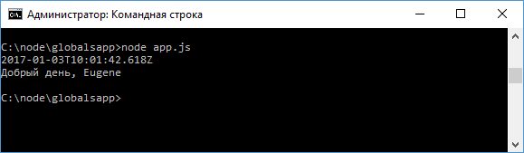

# Объект global и глобальные переменные

Node.js предоставляет специальный объект `global`, который предоставляет доступ к глобальным, то есть доступным из каждого модуля приложения, переменным и функциям. Примерным аналогом данного объекта в javascript для браузера является объект `window`. Все доступные глобальные объекты можно посмотреть в документации.

Для примера создадим следующий модуль `greeting.js`:

```js
let currentDate = new Date()

global.date = currentDate

module.exports.getMessage = function () {
  let hour = currentDate.getHours()
  if (hour > 16) return 'Добрый вечер, ' + global.name
  else if (hour > 10) return 'Добрый день, ' + name
  else return 'Доброе утро, ' + name
}
```

Здесь, во-первых, происходит установка глобальной переменной `date`: `global.date = currentDate;`

Во-вторых, в модуле получаем глобальную переменную name, которая будет установлена из вне. При этом обратиться к глобальной переменной name мы можем через объект `global`: `global.name`, либо просто через имя `name`, так как переменная глобальная.

Определим следующий файл приложения `app.js`:

```js
const greeting = require('./greeting')

global.name = 'Eugene'

global.console.log(date)
console.log(greeting.getMessage())
```

Здесь устанавливаем глобальную переменную `name`, которую мы получаем в модуле `greeting.js`. И также выводим на консоль глобальную переменную `date`. Причем все глобальные функции и объекты, например, `console`, также доступны внутри `global`, поэтому мы можем написать и `global.console.log()`, и просто `console.log()`.

Запустим файл `app.js`:



Однако по возможности все таки рекомендуется избегать определения и использования глобальных переменных, и преимущественно ориентироваться на создание переменных, инкапсулированных в рамках отдельных модулей.
