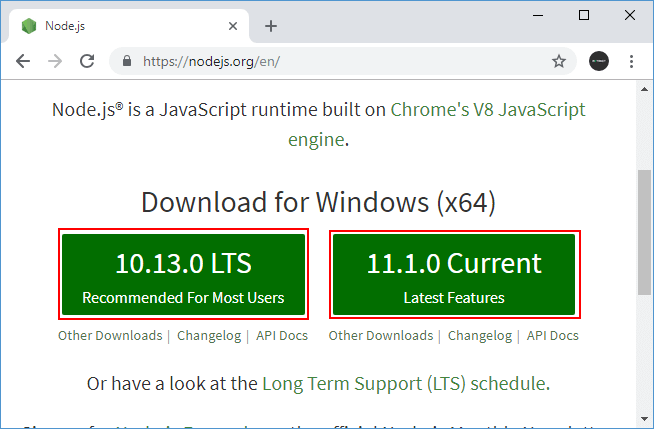
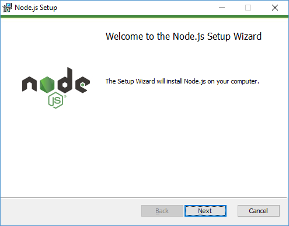
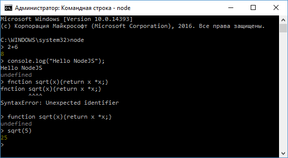
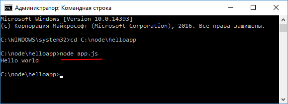

# Что такое Node JS. Начало работы

**Node.js** представляет среду выполнения кода на JavaScript, которая построена на основе движка JavaScript Chrome V8, который позволяет транслировать вызовы на языке JavaScript в машинный код. Node.js прежде всего предназначен для создания серверных приложений на языке JavaScript. Хотя также существуют проекты по написанию десктопных приложений (Electron) и даже по созданию кода для микроконтроллеров. Но прежде всего мы говорим о Node.js, как о платформе для создания веб-приложений.

Node.js является открытым проектом, исходники которого можно посмотреть на [github.com](https://github.com/nodejs).

## Установка

Для загрузки перейдет на официальный сайт [https://nodejs.org/en/](https://nodejs.org/en/). На главной странице мы сразу увидим две возможные опции для загрузки: самая последняя версия NodeJS и LTS-версия.



Загрузим последнюю версию. В моем случае это версия 11.1.0. Для Windows установщик представляет файл с расширением `msi`. После запуска откроется программа установщика:



После успешной установки вы можем ввести в командной строке/терминале команду `node -v`, и нам отобразится текущая версия node.js:

```
C:\WINDOWS\system32>node -v
v11.1.0
```

Версии node.js для других операционных систем наряду с исходниками можно найти по адресу [https://nodejs.org/en/download/](https://nodejs.org/en/download/)

## Инструменты разработки

Для разработки под Node JS достаточно простейшего текстового редактора, в частности, Notepad++. Также можно использовать более продвинутые редакторы типа Atom, Sublime, Visual Studio Code, либо среды разработки, которые поддерживают работу с Node.JS, например, Visual Studio или WebStorm.

## REPL

После установки NodeJS нам становится доступным такой инструмент как REPL. REPL (Read Eval Print Loop) представляет возможность запуска выражений на языке JavaScript в командной строке или терминале.

Так, запустим командную строку (на Windows) или терминал (на OS X или Linux) и введем команду `node`. После ввода этой команды мы можем выполнять различные выражения на JavaScript:

```
C:\WINDOWS\system32>node
> 2+6
8
>
```

Или используем какую-нибудь функцию JS:

```
> console.log("Hello NodeJS");
Hello NodeJS
undefined
>
```

Можно определять свои функции и затем их вызывать, например, возведение числа в квадрат:

```
> function sqrt(x){return x * x;}
undefined
>sqrt(5)
25
>
```

Если мы введем что-то неправильно, то REPL укажет об ошибке:



## Выполнение файла

Вместо того чтобы вводить весь код напрямую в консоль, удобнее вынести его во внешний файл. Например, создадим на жестком диске новый каталог, допустим, `C:\node\helloapp`, в который поместим новый файл `app.js` со следующим кодом:

```js
console.log('Hello world')
```

В командной строке перейдем с помощью команды `cd` к каталогу `helloapp`, а затем выполним команду:

```
node app.js
```

Данная команда выполнит код из файла `app.js`:


