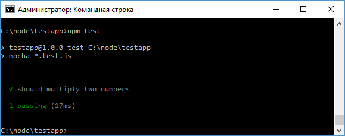
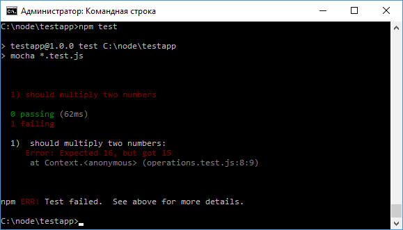
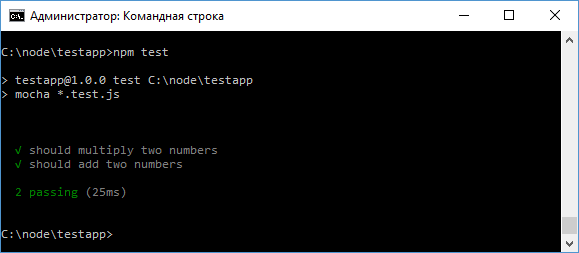
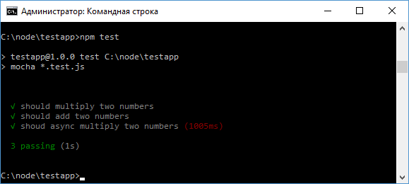

# Mocha

Важное место при разработке на Node.js занимает тестирование. И в данном случае гораздо легче воспользоваться имеющимися фреймворками, которые упрощают процесс тестирования. Одним из таких фреймворков является Mocha. Подробнее о фреймворке можно узнать на официальной странице [Mochajs](https://mochajs.org/). В данном же случае мы рассмотрим некоторые базовые стороны работы с ним.

Определим в папке проекта новый файл `package.json` со следующим содержимым:

```json
{
  "name": "testapp",
  "version": "1.0.0"
}
```

Далее добавим в проект пакет `mocha` с помощью следующей команды:

```
npm install mocha --save-dev
```

Так как фреймворк Mocha необходим только для тестирования приложения, то он добавляется в файле `package.json` в секцию `devDependencies` с помощью команды `--save-dev`.

Для тестирования определим простейший модуль. Для этого добавим в проект файл `operations.js` со следующим содержимым:

```js
module.exports.multiply = function (x, y) {
  return x * y
}
```

Здесь определена функция умножения двух чисел.

Для тестирования этого модуля добавим в проект новый файл `operations.test.js`:

```js
var operations = require('./operations')

it('should multiply two numbers', function () {
  var expectedResult = 15
  var result = operations.multiply(3, 5)
  if (result !== expectedResult) {
    throw new Error(
      `Expected ${expectedResult}, but got ${result}`
    )
  }
})
```

Рассмотрим этот тест. Для тестирования результата применяется функция `it()`, которая предоставляется фреймворком Mocha.

Эта функция принимает два параметра: текстовое описание тестируемого действия, по которому его можно идентифицировать, и саму тестирующую функцию.

К примеру, нам надо проверить работу выше определенной функции `multiply()`, которая умножает два числа. Для этого в эту функцию надо передать два числа и сравнить ее результат с ожидаемым. Если результат не совпадает с ожидаемым значением, то генерируется ошибка.

Для упрощения запуска тестов изменим файл `package.json` следующим образом:

```json
{
  "name": "testapp",
  "version": "1.0.0",
  "scripts": {
    "test": "mocha *.test.js"
  },
  "devDependencies": {
    "mocha": "^3.2.0"
  }
}
```

Здесь добавляется секция `"scripts"`, в которой определяется команда `"test"`. Эта команда выполняет команду `"mocha *.test.js"`, которая запускает тестирование с помощью mocha, передавая фреймворку все файлы, которые оканчиваются на `".test.js"`

Если у нас один файл теста, то мы могли бы сразу указать полное имя файла, типа mocha `operations.test.js`

Далее в командной строке перейдем к папке проекта и выполним команду:

```
npm test
```



В данном случае консоль указывает, что тест пройден.

Но, если мы изменим код теста:

```js
var operations = require('./operations')

it('should multiply two numbers', function () {
  var expectedResult = 16
  var result = operations.multiply(3, 5)
  if (result !== expectedResult) {
    throw new Error(
      `Expected ${expectedResult}, but got ${result}`
    )
  }
})
```

То тест не будет проходить, так как результат - `15` не равен ожидаемому результату - числу `16`. И консоль уведомит об этом при повторном запуске теста:



Подобным образом мы можем определять и другие тесты. Например, изменим файл модуля `operations.js`:

```js
module.exports.multiply = function (x, y) {
  return x * y
}
module.exports.add = function (x, y) {
  return x + y
}
```

Теперь в файле была добавлена функция для сложения чисел. Протестируем ее в `operations.test.js`:

```js
var operations = require('./operations')

it('should multiply two numbers', function () {
  var expectedResult = 15
  var result = operations.multiply(3, 5)
  if (result !== expectedResult) {
    throw new Error(
      `Expected ${expectedResult}, but got ${result}`
    )
  }
})
it('should add two numbers', function () {
  var expectedResult = 16
  var result = operations.add(9, 7)
  if (result !== expectedResult) {
    throw new Error(
      `Expected ${expectedResult}, but got ${result}`
    )
  }
})
```

Запустим тест:



## Тестирование асинхронных функций

Немного отличается тестирование асинхронных функций. Например, определим в модуле `operations.js` асинхронную функцию:

```js
module.exports.multiply = function (x, y) {
  return x * y
}
module.exports.add = function (x, y) {
  return x + y
}

module.exports.multiplyAsync = function (a, b, callback) {
  setTimeout(function () {
    callback(a * b)
  }, 1000)
}
```

Протестируем эту функцию в `operations.test.js`:

```js
var operations = require('./operations')

it('should multiply two numbers', function () {
  var expectedResult = 15
  var result = operations.multiply(3, 5)
  if (result !== expectedResult) {
    throw new Error(
      `Expected ${expectedResult}, but got ${result}`
    )
  }
})
it('should add two numbers', function () {
  var expectedResult = 16
  var result = operations.add(9, 7)
  if (result !== expectedResult) {
    throw new Error(
      `Expected ${expectedResult}, but got ${result}`
    )
  }
})

it('shoud async multiply two numbers', function (done) {
  var expectedResult = 12
  operations.multiplyAsync(4, 3, function (result) {
    if (result !== expectedResult) {
      throw new Error(
        `Expected ${expectedResult}, but got ${result}`
      )
    }
    done()
  })
})
```

Особенностью тестирования асинхронных функций является то, что чтобы они завершились до завершения теста, в тестирующую функцию передается функция `done()`. Причем при окончании тестирования нам надо вызвать эту функцию. Тем самым через подобную функцию Mocha сможет контролировать выполнение теста.



Если мы не передадим функцию `done` в тест, тогда тест завершится раньше, чем завершится асинхронная функция.
