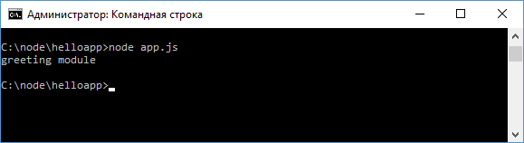
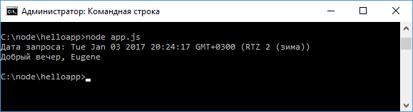
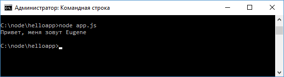

# Модули

Node.js использует модульную систему. То есть вся встроенная функциональность разбита на отдельные пакеты или модули. Модуль представляет блок кода, который может использоваться повторно в других модулях.

При необходимости мы можем подключать нужные нам модули. Какие встроенные модули есть в node.js и какую функциональность они предоставляют, можно узнать из [документации](https://nodejs.org/api/).

Для загрузки модулей применяется функция `require()`, в которую передается название модуля. К примеру, в первом приложении из предыдущей темы для получения и обработки запроса был необходим модуль `http`:

```js
const http = require('http')
```

После получения модуля мы сможем использовать весь определенный в нем функционал, который опять же можно посмотреть в [документации](https://nodejs.org/api/http.html).

Подобным образом мы можем загружать и использовать другие встроенные модули. Например, используем модуль `os`, который предоставляет информацию об окружении и операционной системе:

```js
const os = require('os')
// получим имя текущего пользователя
let userName = os.userInfo().username

console.log(userName)
```

Мы не ограничены встроенными модулями и при необходимости можем создать свои. Так, в прошлой теме проект состоял из файла `app.js`, в котором создавался сервер, обрабатывающий запросы. Добавим в тот же каталог новый файл `greeting.js` и определим в нем следующий код:

```js
console.log('greeting module')
```

В файле `app.js` подключим наш модуль:

```js
const greeting = require('./greeting')
```

В отличие от встроенных модулей для подключения своих модулей надо передать в функцию `require` относительный путь с именем файла (расширение файла необязательно):

```js
const greeting = require('./greeting')
```

Запустим приложение:



На консоль выводится та строка, которая определена в файле `greeting.js`.

Теперь изменим файл `greeting.js`:

```js
let currentDate = new Date()
module.exports.date = currentDate

module.exports.getMessage = function (name) {
  let hour = currentDate.getHours()
  if (hour > 16) return 'Добрый вечер, ' + name
  else if (hour > 10) return 'Добрый день, ' + name
  else return 'Доброе утро, ' + name
}
```

Здесь определена переменная `currentDate`. Однако из вне она недоступна. Она доступна только в пределах данного модуля. Чтобы какие переменные или функции модуля были доступны, необходимо определить их в объекте `module.exports`. Объект `module.exports` - это то, что возвращает функция `require()` при получении модуля.

Вообще объект `module` представляет ссылку на текущий модуль, а его свойство `exports` определяет все свойства и методы модуля, которые могут быть экспортированы и использованы в других модулях. Подробнее определение загрузки модуля и все его функции можно посмотреть на странице [https://github.com/nodejs/node/blob/master/lib/module.js](https://github.com/nodejs/node/blob/master/lib/module.js).

В частности, здесь определяется свойство `date` и метод `getMessage`, который принимает некоторый параметр.

Далее изменим файл `app.js`:

```js
const os = require('os')
const greeting = require('./greeting')

// получим имя текущего пользователя
let userName = os.userInfo().username

console.log(`Дата запроса: ${greeting.date}`)
console.log(greeting.getMessage(userName))
```

Все экспортированные методы и свойства модуля доступны по имени: `greeting.date` и `greeting.getMessage()`.

Перезапустим приложение:



## Определение конструкторов и объектов в модуле

Кроме определения простейших функций или свойств в модуле могут определяться сложные объекты или функции конструкторов, которые затем используются для создания объектов. Так, добавим в папку проекта новый файл `user.js`:

```js
function User(name, age) {
  this.name = name
  this.age = age
  this.displayInfo = function () {
    console.log(`Имя: ${this.name}  Возраст: ${this.age}`)
  }
}
User.prototype.sayHi = function () {
  console.log(`Привет, меня зовут ${this.name}`)
}

module.exports = User
```

Здесь определена стандартная функция конструктора `User`, которая принимает два параметра. При этом весь модуль теперь указывает на эту функцию конструктора:

```js
module.exports = User
```

Подключим и используем этот модуль в файле `app.js`:

```js
const User = require('./user.js')

let eugene = new User('Eugene', 32)
eugene.sayHi()
```

Запустим приложение:


