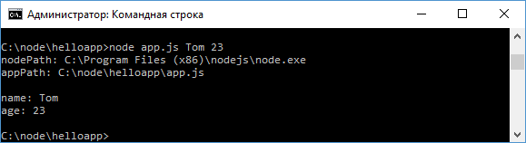

# Передача параметров приложению

При запуске приложения из терминала/командной строки мы можем передавать ему параметры. Для получения параметров в коде приложения применяется массив `process.argv`. Это аналогично тому, как в языках C/C++/C#/Java в функцию `main` передается набор аргументов в виде строкового массива.

Первый элемент этого массива всегда указывает на путь к файлу `node.exe`, который вызывает приложение. Второй элемент массив всегда указывает на путь к файлу приложения, который выполняется.

К примеру, определим следующий файл `app.js`:

```js
let nodePath = process.argv[0]
let appPath = process.argv[1]
let name = process.argv[2]
let age = process.argv[3]

console.log('nodePath: ' + nodePath)
console.log('appPath: ' + appPath)
console.log()
console.log('name: ' + name)
console.log('age: ' + age)
```

В данном случае мы ожидаем, что приложению будут переданы два параметра: `name` и `age`.

Теперь запустим приложение с помощью следующей команды:

```
node app.js Tom 23
```

В данном случае `Tom` и `23` - это те значения, которые помещаются соответственно в `process.argv[2]` и `process.argv[3]`:


