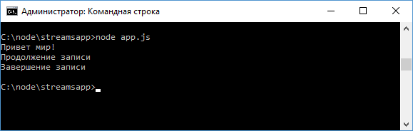

# Stream

**Stream** представляет поток данных. Потоки бывают различных типов, среди которых можно выделить [потоки для чтения](https://nodejs.org/api/stream.html#stream_readable_streams) и [потоки для записи](https://nodejs.org/api/stream.html#stream_writable_streams).

При создании сервера в первой главе мы уже сталкивались с потоками:

```js
const http = require('http')

http
  .createServer(function (request, response) {})
  .listen(3000)
```

Параметры `request` и `response`, которые передаются в функцию и с помощью которых мы можем получать данные о запросе и управлять ответом, как раз представляют собой потоки: `request` - поток для чтения, а `response` - поток для записи.

Используя потоки чтения и записи, мы можем считывать и записывать информацию в файл. Например:

```js
const fs = require('fs')

let writeableStream = fs.createWriteStream('hello.txt')
writeableStream.write('Привет мир!')
writeableStream.write('Продолжение записи \n')
writeableStream.end('Завершение записи')
let readableStream = fs.createReadStream(
  'hello.txt',
  'utf8'
)

readableStream.on('data', function (chunk) {
  console.log(chunk)
})
```

Для создания потока для записи применяется метод `fs.createWriteStream()`, в который передается название файла. Если вдруг в папке нет такого файла, то он создается.

Запись данных производится с помощью метода `write()`, в который передаются данные. Для окончания записи вызывается метод `end()`.

После этого в папке проекта появляется файл `hello.txt`, который можно открыть в любом текстовом редакторе.

Для создания потока для чтения используется метод `fs.createReadStream()`, в который также передается название файла. В качестве опционального параметра здесь передается кодировка, что позволит сразу при чтении кодировать считанные данные в строку в указанной кодировке.

Сам поток разбивается на ряд кусков или чанков (chunk). И при считывании каждого такого куска, возникает событие `data`. С помощью метода `on()` мы можем подписаться на это событие и вывести каждый кусок данных на консоль:

```js
readableStream.on('data', function (chunk) {
  console.log(chunk)
})
```

Запустим файл на выполнение:



Только работой с файлами функциональность потоков не ограничивается, также имеются сетевые потоки, потоки шифрования, архивации и т. д., но общие принципы работы с ними будут те же, что и у файловых потоков.
