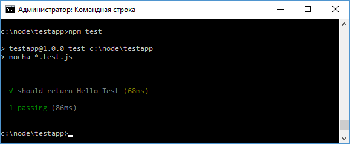
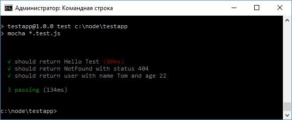

# Тестирование Express

Для тестирования функциональности, которая использует Express, мы можем воспользоваться специальным инструментом - [supertest](https://www.npmjs.com/package/supertest).

Вначале установим `supertest` с помощью команды:

```
npm install supertest --save-dev
```

Первым делом определим простенький файл приложения `app.js`:

```js
const express = require('express')
var app = express()

app.get('/', function (request, response) {
  response.send('Hello Test')
})

app.listen(3000)

module.exports.app = app
```

Данное приложение при обращении по главному маршруту `/` отправляет в ответ некоторую строку `Hello Test`.

И чтобы задействовать данное приложение в тесте, оно оформляется в виде модуля: `module.exports.app = app;`

Далее для тестов создадим в каталоге проекта новый файл `app.test.js`:

```js
const request = require('supertest')

var app = require('./app').app

it('should return Hello Test', function (done) {
  request(app).get('/').expect('Hello Test').end(done)
})
```

Для тестирования получаем модули `supertest` и нашего приложения и используем метод `it()` для получения результата.

Для настройки и выполнения теста в `request` передается функционал приложения:

```js
request(app)
```

устанавливаем маршрут, по которому будем обращаться в приложении:

```js
get('/')
```

Устанавливаем ожидаемый результат через метод `expect`:

```js
expect('Hello Test')
```

и с помощью метода `end()` выполняем тест:

```js
end(done)
```

Для запуска этого теста у нас опять же должна быть настроена должным образом команда `test` в файле `package.json`:

```json
{
  "name": "testapp",
  "version": "1.0.0",
  "scripts": {
    "test": "mocha *.test.js"
  },
  "devDependencies": {
    "mocha": "^3.2.0",
    "supertest": "^2.0.1"
  },
  "dependencies": {
    "express": "^4.14.0"
  }
}
```

Запустим тест на выполнение:



Зеленый маркер в сообщении теста указывает, что тест пройден успешно, а приложение действительно возвращает строку `Hello Test`.

Рассмотрим еще пару тестов. Для этого изменим файл `app.js` следующим образом:

```js
const express = require('express')
var app = express()

app.get('/', function (request, response) {
  response.send('Hello Test')
})

app.get('/error', function (request, response) {
  response.status(404).send('NotFound')
})

app.get('/user', function (request, response) {
  response.send({ name: 'Tom', age: 22 })
})

app.listen(3000)

module.exports.app = app
```

Здесь определена обработка для трех маршрутов. Для их тестирования изменим файл `app.test.js`:

```js
const request = require('supertest')
const assert = require('assert')

var app = require('./app').app

it('should return Hello Test', function (done) {
  request(app).get('/').expect('Hello Test').end(done)
})

it('should return NotFound with status 404', function (done) {
  request(app)
    .get('/error')
    .expect(404)
    .expect('NotFound')
    .end(done)
})

it('should return user with name Tom and age 22', function (done) {
  request(app)
    .get('/user')
    .expect(function (response) {
      assert.deepEqual(response.body, {
        name: 'Tom',
        age: 22,
      })
    })
    .end(done)
})
```

Если нам надо проверить статусный код, то также можем передать ожидаемый код статуса в метод `expect(404)`

Если необходимо проверить какие-то комплексные объекты, которые отправляются в ответе клиенту, то в метод expect передается функция, в которую в качестве параметра передается объект ответа `response`. А через объект `response.body` можно получить весь ответ и сравнить его с ожидаемым значением. Для сравнения комплексных объектов можно применить метод `deepEqual()` или `deepStrictEqual()` библиотеки `assert`, рассмотренной в прошлой теме.

Запустим тесты и проверим результат:


