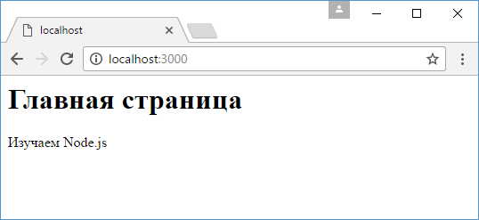

# Шаблоны

В прошлой теме использовался файл html, который имел статичное неизменяющееся содержимое. Однако мы также можем применять специальные инструменты - шаблоны, вместо которых в файл будет вставляться какой-то определенный текст. Например, изменим файл `index.html` следующим образом:

```html
<!DOCTYPE html>
<html>
  <head>
    <title>Главная</title>
    <meta charset="utf-8" />
  </head>
  <body>
    <h1>{header}</h1>
    <p>{message}</p>
  </body>
  <html></html>
</html>
```

Вместо конкретного содержимого здесь определены прейсхолдеры `{header}` и `{message}`, вместо которых может вставляться любой текст.

Изменим файл `app.js`:

```js
const http = require('http')
const fs = require('fs')

http
  .createServer(function (request, response) {
    fs.readFile('index.html', 'utf8', function (
      error,
      data
    ) {
      let message = 'Изучаем Node.js'
      let header = 'Главная страница'
      data = data
        .replace('{header}', header)
        .replace('{message}', message)
      response.end(data)
    })
  })
  .listen(3000)
```

Здесь получаем содержимое файла и проводим его дополнительную обработку, заменяя плейсхолдеры на конкретный текст с помощью метода `data.replace()`.

При обращении к приложению мы получим полноценную html-страницу без плейсхолдеров:


