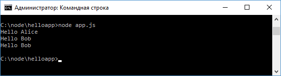
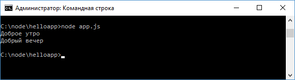

# Работа с модулями

Рассмотрим некоторые аспекты работы с модулями в Node.js. Прежде всего надо отметить, что подключаемые модули кэшируются. В частности, в файле [https://github.com/nodejs/node/blob/master/lib/internal/modules/cjs/loader.js](https://github.com/nodejs/node/blob/master/lib/internal/modules/cjs/loader.js) есть такие строки:

```js
var filename = Module._resolveFilename(
  request,
  parent,
  isMain
)

var cachedModule = Module._cache[filename]
if (cachedModule) {
  updateChildren(parent, cachedModule, true)
  return cachedModule.exports
}
```

Это, с одной стороны, увеличивает производительность, а с другой, может создать некоторые проблемы, если мы не будем учитывать этот аспект. Например, возьмем проект из прошлой темы, где в главный файл приложения `app.js` подключается модуль `greeting.js`. Изменим файл `greeting.js` следующим образом:

```js
module.exports.name = 'Alice'
```

В файле определена только одна строка, которая устанавливает свойство `name`.

Изменим код файла `app.js`:

```js
var greeting1 = require('./greeting.js')
console.log(`Hello ${greeting1.name}`) //Hello Alice

var greeting2 = require('./greeting.js')
greeting2.name = 'Bob'

console.log(`Hello ${greeting2.name}`) //Hello Bob
// greeting1.name тоже изменилось
console.log(`Hello ${greeting1.name}`) //Hello Bob
```

Несмотря на то, что здесь два раза получаем модуль с помощью функции `require`, но обе переменных - `greeting1` и `greeting2` будут указывать на один и тот же объект.



## Структура модулей

Нередко модули приложения образуют какие-то отдельные наборы или области. Такие наборы модулей лучше помещать в отдельные каталоги. Например, создадим в каталоге приложения подкаталог `welcome` и создадим в нем три новых файла:

- `index.js`
- `morning.js`
- `evening.js`

В итоге общая структура проекта пусть будет выглядеть следующим образом:

- `welcome`
  - `index.js`
  - `morning.js`
  - `evening.js`
- `app.js`
- `greeting.js`

В файл `morning.js` поместим следующую строку:

```js
module.exports = 'Доброе утро'
```

Аналогично изменим файл `evening.js`:

```js
module.exports = 'Добрый вечер'
```

Эти два файла определяют сообщения приветствия в зависимости от времени суток.

И определим в файле `index.js` следующий код:

```js
const morning = require('./morning')
const evening = require('./evening')

module.exports = {
  getMorningMessage: function () {
    console.log(morning)
  },
  getEveningMessage: function () {
    console.log(evening)
  },
}
```

В модуле определен объект, который имеет две функции для вывода приветствий.

Теперь используем этот модуль в файле `app.js`:

```js
const welcome = require('./welcome')

welcome.getMorningMessage()
welcome.getEveningMessage()
```

Несмотря на то, что нет такого файла как `welcome.js`, но если в проекте есть каталог, который содержит файл с именем `index.js`, то мы можем обращаться к модулю по имени каталога, как в данном случае.

Запустим приложение, и на консоль будут выведены оба приветствия:


