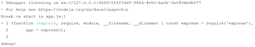
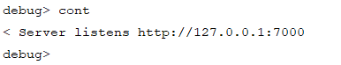
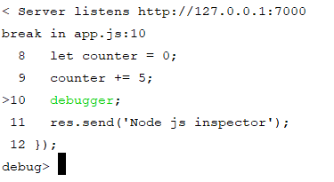
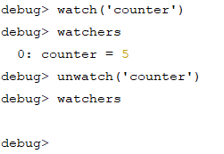
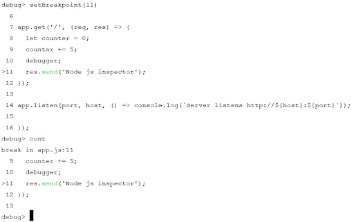
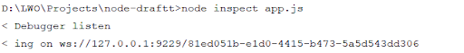
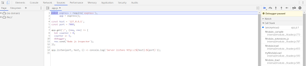

# Отладка

Под **отладкой** понимается процесс поиска и устранения возникающих в процессе работы приложения ошибок с помощью специально созданных для этого инструментов.

Для отладки Node.js приложений при запуске главного скрипта необходимо указать команду `inspect`, которая запускает отдельный процесс для получения и обработки сигналов отладки.

```
node inspect app.js
```

По умолчанию процесс Node.js отладки запускается по адресу `127.0.0.1:9229`. Для задания других хоста и порта, используйте параметр `--inspect` в следующем формате.

```
node inspect --inspect=127.0.0.1:5000 app.js
```

!!! note ""

    Для запуска приложения в режиме отладки и установки точки останова на первой же строке, вместо параметра `--inspect` используйте `--inspect-brk`.

## Отладка Node js через CLI

Теперь рассмотрим процесс Node.js отладки на примере.

_app.js_

```js
const express = require('express'),
  app = express()

const host = '127.0.0.1'
const port = 7000

app.get('/', (req, res) => {
  let counter = 0
  counter += 5
  debugger
  res.send('Node js inspector')
})

app.listen(port, host, () =>
  console.log(`Server listens http://${host}:${port}`)
)
```

После запуска приведенного примера командой `inspect`, отладчик остановится на первой строке и предложит ввести команду. Список возможных команд:

- `cont` - продолжает выполнение скрипта;
- `next` - следующее действие (переходит на следующую строку кода);
- `step` - "входит" в исходный код текущего исполняемого выражения;
- `step` - "входит" в исходный код текущего исполняемого выражения;
- `pause` - ставит на паузу выполнение скрипта.



После ввода команды `cont` приложение будет запущено.



Теперь отладчик остановит выполнение скрипта при обращении к маршруту `/` на строке `debugger`;.



Чтобы узнать значения переменных в точке останова скрипта используйте в качестве команды функцию `watch()`, которой передается имя переменной, значение которой необходимо узнать.

Теперь чтобы вывести значение желаемой переменной используйте команду `watchers`, которая выводит значения всех выражений, которые были заданы функцией `watch()`.

Для удаления переменной из списка отслеживаемых выражений имеется функция `unwatch()`.



!!! note ""

    Для запуска последней выполненной команды просто нажмите Enter.

Точка останова уже в процессе отладки может быть установлена с помощью функции `setBreakpoint()`, которая передается один, либо два аргумента. Если один - то указывается номер строки в текущем скрипте, на которой необходимо остановить его выполнение.



Если передать `setBreakpoint()` два параметра, то первым указывается имя файла, где необходимо установить точку останова, а вторым - номер строки в этом файле.

## Отладка Node js в Chrome

Процессу отладки назначается уникальный идентификатор (`UUID`), входящий в состав URL, по которому к нему можно обратиться через браузер Google Chrome. `UUID` будет выведен сразу после начала выполнения команды запуска приложения в режиме отладки.



Перейдя по ссылке `chrome-devtools://devtools/bundled/js_app.html?experiments=true&v8only=true&ws=127.0.0.1:9229/81ed051b-e1d0-4415-b473-5a5d543dd306`, где `81ed051b-e1d0-4415-b473-5a5d543dd306` это ваш `UUID`, можно осуществлять отладку Node.js приложения отладчиком Chrome.

После перехода по ссылке вы должны увидеть следующее.



Если версия браузера Google Chrome 67 и выше, то в URL `app_js.html` необходимо заменить на `inspector.html`.
