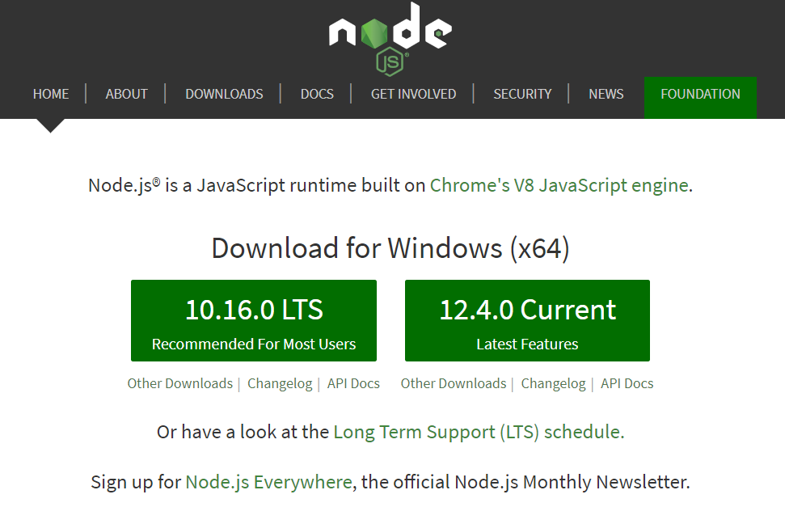
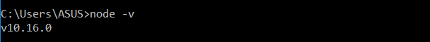

# Установка

**Установка Node.js** занимает всего несколько минут независимо от операционной системы. Сперва перейдите на [официальный сайт](https://nodejs.org/en/) платформы, где автоматически определяется тип и разрядность вашей операционной системы. На сайте предлагается установить Node.js либо самой последней (Current), либо стабильной версии (LTS).



Стабильная LTS версия в первую очередь предназначена для корпоративной разработки и в основном используется IT-компаниями, в которых частое обновление версий сопряжено с определенными трудностями в области закупок или согласно условия договоров со своими клиентами.

Версия Current имеет все последния наработки и обновления платформы, но она может содержать в себе ошибки. Поэтому рекомендуется установить Node.js именно версии LTS

Для операционной системы Windows или MacOS установка Node.js осуществляется скачанным дистрибутивом в формате `msi` или `pkg` соответственно. В Unix-системах более эффективным будет использование пакетного менеджера.

!!! node ""

    Если вам необходимо установить Node.js на систему отличную от той, с которой вы зашли на официальный сайт, перейдите в раздел Downloads.

Чтобы удостовериться, что установка Node.js прошла успешно, выполните в командной строке следующее.

```
node -v
```

Если вы всё сделали правильно, то в консоли отобразится номер версии Node.js.


