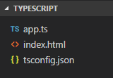

# Файл конфигурации tsconfig.json

С помощью файла `tsconfig.json` можно настроить проект TypeScript. В частности, этот файл выполняет следующие задачи:

- устанавливает корневой каталог проекта TypeScript
- выполняет настройку параметров компиляции
- устанавливает файлы проекта

Для его использования достаточно вручную добавить новый файл с именем `tsconfig.json` в корень проекта.



## Структура файла

`tsconfig.json` представляет собой стандартный файл в формате json, который содержит ряд секций. Так, секция `"compilerOptions"` настраивает параметры компиляции. Здесь можно указать необходимые параметры и их значения. Параметры называются также, как и в командной строке. И соответственно значения мы им можем передать те же, что передаются в командной строке (или терминале). Например:

```json
{
  "compilerOptions": {
    "target": "es5",
    "removeComments": true,
    "outDir": "js",
    "sourceMap": true
    "outFile": "main.js"
  }
}
```

Здесь используется все те же параметры, которые применяются при компиляции в командной строке. Например, параметр `"target"` указывает, какой стандарт JavaScript будет применяться при компиляции.

Параметр `"removeComments"` удаляет комментарии. Параметр `"outDir"` задает каталог для скомпилированных файлов. `"sourceMap"` указывает, что надо сгенерировать карту для сопоставления исходных и скомпилированных файлов. И параметр `"outFile"` задает название выходного файла.

При необходимости можно включать другие опции компиляции.

С помощью секции `files` можно установить набор включаемых в проект файлов:

```json
{
  "compilerOptions": {
    "target": "es5",
    "removeComments": true,
    "outFile": "../../built/local/tsc.js"
  },
  "files": ["app.ts", "interfaces.ts", "classes.ts"]
}
```

Если секция `"files"` не указана в файле `tsconfig.json`, то компилятор по умолчанию включает все файлы TypeScript (файлы с расширением `_.ts` и `_.tsx`), которые находятся в каталоге и подкаталогах проекта. Если же указана секция `"files"`, то используются только файлы из этой секции.

Параметр `exclude`, наоборот, позволяет исключить при компиляции определенные файлы:

```json
{
  "compilerOptions": {
    "target": "es5",
    "removeComments": true,
    "outFile": "../../built/local/tsc.js"
  },
  "exclude": ["wwwroot", "node_modules"]
}
```

При компиляции компилятор не будет учитывать файлы TypeScript, которые находятся в каталогах из секции `exclude`.

При этом следует учитывать, что если в файле одновременно будут заданы обе секции `files` и `exclude`, то секция `exclude` будет игнорироваться.

Все файлы, на которые есть ссылки в файлах из секции `"files"`, также компилируются.

Параметр `compileOnSave` при значении `true` указывает используемой IDE сгенерировать все файлы js при каждом сохранении файлов TypeScript:

```json
{
  "compileOnSave": true,
  "compilerOptions": {
    "target": "es5"
  }
}
```

## Использование файла tsconfig.json

Файл `tsconfig.json` используется при компиляции в том случае, если компилятору не передаются названия файлов, которые надо скомпилировать. В этом случае компилятор TypeScript просматривает текущий каталог, ищет в нем файл `tsconfig.json` и затем при компиляции использует те параметры, которые определены в этом файле.

Если же компилятору передаются названия файлов, например, `tsc app.ts`, то файл `tsconfig.json` игнорируется.

## Ссылки

- [Файл конфигурации tsconfig.json](https://metanit.com/web/typescript/1.5.php)
