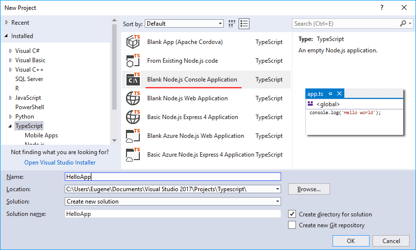
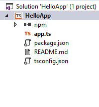
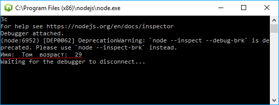

# Первое приложение на TypeScript в Visual Studio

Среда разработки Visual Studio имеет встроенные возможности по созданию проектов с использованием TypeScript. Итак, создадим первое приложение на TypeScript в Visual Studio 2017. При создании нового проекта нужно выбрать в левом меню TypeScript.

Здесь нам доступны по умолчанию несколько шаблонов проектов:



Эти проекты позволяют использовать TypeScript в различных ситуациях - в связке с Node.js, Apache Cordova и т.д. В данном случае выберем самый простой тип проекта, который можно использовать для изучения TS - Blank Node.js Console Application.

В итоге Visual Studio создаст следующий проект:



Проект по умолчанию имеет следующие файлы:

- `app.ts`: файл с кодом на TypeScript
- `package.json`: файл с определением пакетов и прочей конфигурации для Node.js
- `tsconfig.json`: файл конфигурации TypeScript

Ключевым элементом здесь является файл `app.ts`, который выполняется при запуске приложения. Изменим его код следующим образом:

```typescript
class User {
  name: string
  age: number
  constructor(_name: string, _age: number) {
    this.name = _name
    this.age = _age
  }
}
var tom: User = new User('Том', 29)
console.log('Имя: ', tom.name, ' возраст: ', tom.age)
```

Как и в прошлой теме, здесь определяется класс User, создается объект этого класса, и данные объекта выводятся на консоль.

Запустим проект на выполнение, и перед нами откроется следующая консоль:



## Ссылки

- [Первое приложение на TypeScript в Visual Studio](https://metanit.com/web/typescript/1.3.php)
