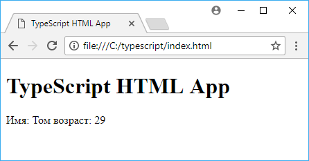

# Установка и компиляция из командной строки

Чтобы начать работать с TypeScript, установим необходимый инструментарий. Установить TypeScript можно двумя способами: через пакетный менеджер NPM или как плагин к Visual Studio

## Установка через NPM

Для установки через NPM вначале естественно необходимо установить Node.js (если он ранее не был установлен). После установки Node.js необходимо запустить следующую команду в командной строке (Windows) или терминале (Linux):

```bash
npm install -g typescript
```

При установке на MacOS также требуется ввести команду `sudo`. При вводе данной команды терминал запросит логин и пароль пользователя для установки пакета:

```bash
sudo npm install -g typescript
```

Вполне возможно, что ранее уже был установлен TypeScript. В этом случае его можно обновить до последней версии с помощью команды

```bash
npm update -g typescript
```

Для проверки версии необходимо ввести команду

```bash
tsc -v
```

## Установка в качестве плагина Visual Studio

Если мы используем Visual Studio, то при ее установке автоматически устанавливаются все необходимые средства для работы с TS, и нам не надо предпринимать никаких дополнительных действий.

Так, после установки средств разработки для TypeScript по пути `C:\Program Files (x86)\Microsoft SDKs\TypeScript\[номер_версии]` мы можем увидеть все установленные файлы, в том числе и сам файл компилятора `tsc.exe`.

## Компиляция приложения

Для начала создадим каталог приложения. В моем случае это будут папка по пути `C:/typescript`. В каталог добавим файл `index.html`. Откроем этот файл в любом текстовом редакторе и определим в нем следующий код:

```html
<!DOCTYPE html>
<html>
  <head>
    <meta charset="utf-8" />
    <title>TypeScript HTML App</title>
  </head>
  <body>
    <h1>TypeScript HTML App</h1>
    <div id="content"></div>
    <script src="app.js"></script>
  </body>
</html>
```

Это обычный файл html, в котором подключается файл app.js. Теперь в том же каталоге создадим файл app.ts. Причем именно app.ts, а не app.js, то есть файл кода typescrypt. Это также обычный текстовый файл. И в нем определим следующее содержание:

```typescript
var el = this.document.getElementById('content')

class User {
  name: string
  age: number
  constructor(_name: string, _age: number) {
    this.name = _name
    this.age = _age
  }
}
var tom: User = new User('Том', 29)
el.innerHTML = 'Имя: ' + tom.name + ' возраст: ' + tom.age
```

Здесь получаем элемент с id=content, создаем класс User. Далее мы разберем создание и использование классов. Создаем объект этого класса с именем Том и возрастом в 29 лет. И выводим данные объекта в элемент. При сохранении файла лучше выбирать кодировку utf-8.

Теперь скомпилируем этот файл. Для этого в командной строке/терминале с помощью команды cd перейдем к каталогу, где расположен файл app.ts (в моем случае это C:\typescript). И для компиляции выполним следующую команду:

```bash
tsc app.ts
```


После компиляции в каталоге проекта создается файл app.js, который будет выглядеть так:

```javascript
var el = this.document.getElementById('content')
var User = (function() {
  function User(_name, _age) {
    this.name = _name
    this.age = _age
  }
  return User
})()
var tom = new User('Том', 29)
el.innerHTML = 'Имя: ' + tom.name + ' возраст: ' + tom.age
```


И теперь мы можем кинуть веб-страницу index.html в браузер:



## Ссылки

- [Установка и компиляция из командной строки](https://metanit.com/web/typescript/1.2.php)
