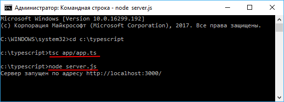

# Загрузка модулей

В прошлой теме было рассмотрено, как определять и импортировать модули в TypeScript. Однако нативно браузеры пока не поддерживают работу с модулями. Может быть, такая возможность будет реализована в прекрасном браузере будущего, однако в настоящий момент для загрузки модулей необходимо применять специальные инструменты, которые называются загрузчиками. В этом теме рассмотрим загрузку модулей с помощью загрузчика SystemJS.

Прежде всего, стоит отметить, что загрузка с сервера производится через AJAX, поэтому такое приложение TypeScript должно быть размещено на веб-сервере. То есть у нас не получится просто кинуть страницу в веб-браузер, как, например, это было в первых темах. Поэтому прежде всего надо определиться с веб-сервером. Веб-сервер может быть любым. В данном случае воспользуемся самым демократичным вариантом - Node.js. Для этого нам будет достаточно установить на свой компьютер Node.js.

Вначале определим папку на жестком диске, где будет располагаться проект. Допустим, это будет папка `C:\typescript`. И первым делом определим в ней файл сервера. Пусть он будет называться `server.js` и будет иметь следующий код:

```javascript
var http = require('http')
var fs = require('fs')

http
  .createServer(function(request, response) {
    // получаем путь после слеша
    var filePath = request.url.substr(1)
    // установка пути по умолчанию
    if (filePath == '') filePath = 'index.html'
    fs.readFile(filePath, function(error, data) {
      if (error) {
        // если файл не найден
        response.statusCode = 404
        response.end('Not Found')
      } else {
        response.end(data)
      }
      return
    })
  })
  .listen(3000, function() {
    console.log('Сервер запущен по адресу http://localhost:3000/')
  })
```

Это самый примитивный сервер, который отдает пользователю статические файлы. Для создания сервера применяется функция `http.createServer`, а для считывания и отправки файлов - функция `fs.readFile()`. Сервер будет запускаться по адресу `http://localhost:3000/`. Для целей тестирования в принципе больше ничего не нужно. Но опять же вместо node.js это может быть любая другая технология сервера - php, asp.net, python и т. д.

Определим в проекте каталог `app`, где будут собственно распложены файлы TypeScript. Добавим в этого каталог файл `devices.ts`, который будет представлять простейший модуль:

```typescript
export interface Device {
  name: string
}

export class Phone implements Device {
  name: string
  constructor(n: string) {
    this.name = n
  }
}

export function Call(phone: Phone): void {
  console.log('Make a call by', phone.name)
}
```

И также в папку `app` добавим главный файл приложения - `app.ts` со следующим кодом:

```typescript
import { Phone, Call as makeCall } from './devices'
let iphone: Phone = new Phone('iPhone X')
makeCall(iphone)
```

В этом файле загружается модуль `devices` и используются определенные в этом модуле типы.

Теперь в корневой папке проекта определим веб-страницу нашего приложения - файл `index.html`:

```html
<!DOCTYPE html>
<html>
  <head>
    <meta charset="utf-8" />
    <title>Модули в TypeScript</title>
  </head>
  <body>
    <h1>Модули в TypeScript</h1>

    <div id="content"></div>
    <script src="https://cdnjs.cloudflare.com/ajax/libs/systemjs/0.21.0/system.js"></script>
    <script>
      SystemJS.config({
        baseURL: 'app',
        packages: {
          '/': { defaultExtension: 'js' }
        }
      })
      System.import('app.js')
    </script>
  </body>
</html>
```

Прежде всего из CDN в низу страницы загружается SystemJS. Далее производится конфигурация загрузчика с помощью функции `SystemJS.config()`, чтобы он использовал наши файлы. Прежде всего с помощью параметра `baseURL: "app"`, что файлы будут располагаться в папке `app` (где у нас сейчас находятся файлы typescript).

Поскольку в итоге мы будем компилировать файлы на TypeScript в JavaScript (так как только javascript поддерживается браузером), то соответственно в данном случае мы будем работать только с файлами js. Для этого определяем параметр `packages: {"/": { defaultExtension: "js" }}`. `"defaultExtension"` указывает на расширение, которое будет добавляться к модулям.

После этого импортируется главный файл приложения - в нашем случае `app.js` (в который компилируется `app.ts`): `System.import("app.js")`.

В итоге весь проект будет выглядеть следующим образом:


Теперь перейдем в консоли к каталогу нашего проекта и скомилируем файлы ts в js с помощью команды:

```bash
tsc app/app.ts
```

После этого в одном каталоге с ts-файлами появятся скомпилированные js-файлы. Затем запустим сервер с помощью команды

```bash
node server.js
```



Стоит отметить, что в реальном приложении компиляции из TS в JS, а также ряд сопутствующих моментов, как сборка, минификация и т. д., как правило, делается автоматически при старте приложения или при изменениях в файле. Для этого используются различные иструменты типа gulp, webpack и другие. В данном же случае мы рассмотриваем именно простейший пример, акцентируя внимание именно на загрузке модулей.

После запуска сервера мы можем перейти в браузере по адресу `http://localhost:3000`, нам отобразится страница, а в консоли браузера мы сможем увидеть результат работы нашего кода на typescript:


## Ссылки

- [Загрузка модулей](https://metanit.com/web/typescript/3.11.php)
