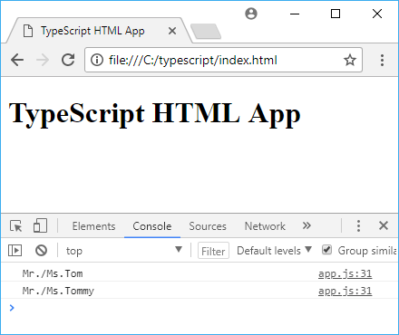

<!-- prettier-ignore-start -->
# Декораторы свойств и методов доступа
{: .no_toc }
<!-- prettier-ignore-end -->

<!-- prettier-ignore -->
1. TOC
{:toc}

## Декораторы свойств

Декоратор свойства представляет функцию, которая принимает два параметра:

```typescript
function MyPropertyDecorator(target: Object, propertyKey: string) {
  // код декоратора
}
```

Где первый параметр представляет конструктор класса, если свойство статическое, либо прототип класса, если свойство нестатическое. А второй параметр представляет имя свойства.

Определим простейший декоратор для свойства:

```typescript
function format(target: Object, propertyKey: string) {
  let _val = this[propertyKey] // получаем значение свойства

  // геттер
  var getter = function() {
    return 'Mr./Ms.' + _val
  }

  // сеттер
  var setter = function(newVal) {
    _val = newVal
  }

  // удаляем свойство
  if (delete this[propertyKey]) {
    // И создаем новое свойство с геттером и сеттером
    Object.defineProperty(target, propertyKey, {
      get: getter,
      set: setter
    })
  }
}

class User {
  @format
  name: string
  constructor(name: string) {
    this.name = name
  }
  print(): void {
    console.log(this.name)
  }
}
let tom = new User('Tom')
tom.print()
tom.name = 'Tommy'
tom.print()
```

Декоратор `format` выполняет небольшое форматирование значение свойства. Для этого вначале мы получаем значение свойства. Создаем геттер, который возвращает отформатированное значение. Далее определяется сеттер, который устанавливает новое значение для свойства. И в конце удаляется старое свойство и создается новое с геттером и сеттером.



## Декоратор метода доступа

Декоратор метода доступа принимает три параметра:

```typescript
function decorator(target: Object, propertyName: string, descriptor: PropertyDescriptor) {
  // код декоратора
}
```

Первый параметр представляет конструктора класса для статического метода, либо прототип класса для обычного метода.

Второй параметр представляет название метода.

Третий параметр представляет объект `PropertyDescriptor`.

Определим простейший декоратор метода доступа:

```typescript
function validator(target: any, propertyKey: string, descriptor: PropertyDescriptor) {
  const oldSet = descriptor.set

  descriptor.set = function(value: string) {
    if (value === 'admin') {
      throw new Error('Invalid value')
    }

    oldSet.call(this, value)
  }
}

class User {
  private _name: string
  constructor(name: string) {
    this.name = name
  }

  public get name(): string {
    return this._name
  }
  @validator
  public set name(n: string) {
    this._name = n
  }
}

let tom = new User('Tom')
tom.name = 'admin'
console.log(tom.name)
```

Декоратор `validator` переопределяет поведение сеттера с помощью свойства `descriptor.set`. Если передаваемое сеттеру значение представляет строку `"admin"`, то генерируется ошибка.

Декоратор достаточно применить только к геттеру или к сеттеру, в любом случае он будет сразу применяться к обоим аксессорам.

И, к примеру, при вызове инструкции `tom.name="admin";` мы столкнемся с ошибкой:


## Ссылки

- [Декораторы свойств и методов доступа](https://metanit.com/web/typescript/6.3.php)
