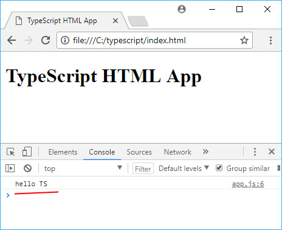
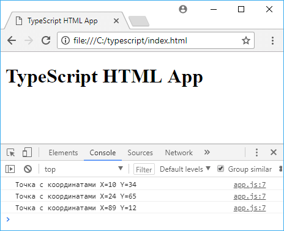

<!-- prettier-ignore-start -->
# Работа с заголовочными файлами
{: .no_toc }
<!-- prettier-ignore-end -->

Для установки связи с внешними файлами скриптов javascript в TS служат декларативные или заголовочные файлы. Это файлы с расширением `.d.ts`, они описывают синтаксис и структуру функций и свойств, которые могут использоваться в программе, не предоставляя при этом конкретной реализации. Их действие во многом похоже на работу файлов с расширением `.h` в языках C/C++. Они выполняют своего рода роль оберток над библиотеками JavaScript.

<!-- prettier-ignore -->
1. TOC
{:toc}

Рассмотрим, как мы можем использовать заголовочные файлы. Иногда в программах на javascript используются глобальные переменные, которые должны быть видны для всех функций приложения. Например, пусть на веб-странице (или во внешнем подключаемом файле javascript) в коде js определена переменная:

```html
<!DOCTYPE html>

<html lang="en">
  <head>
    <meta charset="utf-8" />
    <title>TypeScript HTML App</title>
  </head>
  <body>
    <h1>TypeScript HTML App</h1>

    <div id="content"></div>
    <script>
      var globalVar = 'hello TS'
    </script>
    <script src="app.js"></script>
  </body>
</html>
```

И пусть мы хотим получить к этой переменной доступ в коде TypeScript в файле `app.ts`:

```typescript
class Utility {
  static displayGlobalVar() {
    console.log(globalVar)
  }
}

window.onload = () => {
  Utility.displayGlobalVar()
}
```

При запуске приложения компилятор TS не сможет скомпилировать программу, так как для кода TS глобальная переменная пока не существует. В этом случае нам надо подключать определение глобальной переменной с помощью декларативных файлов. Для этого добавим в проект новый файл, который назовем `globals.d.ts` и который будет иметь следующее содержимое:

```typescript
declare var globalVar: string
```

С помощью ключевого слова `declare` в программу на TS подключается определение глобальной переменной.

И также изменим файл `app.ts`:

```typescript
/// <reference path="globals.d.ts" />

class Utility {
  static displayGlobalVar() {
    console.log(globalVar)
  }
}
window.onload = () => {
  Utility.displayGlobalVar()
}
```

С помощью директивы `reference` в начале файла подключается заголовочный файл `globals.d.ts`. С помощью параметра `path` указывается путь к заголовочному файлу.

То есть у нас получится следующая структура проекта:

app.ts

globals.d.ts

index.html



Подобным образом можно подключить внешние функции. Например, пусть на веб-странице в коде js объявлена такая функция:

```typescript
var globalVar = 'hello TS'
function display() {
  console.log('globalVar: ' + globalVar)
}
```

В этом случае подключение в файле `globals.d.ts` выглядело бы так:

```typescript
declare var globalVar: string
declare function display(): void
```

А в коде TS напрямую можно было бы использовать функцию `display`:

```typescript
/// <reference path="globals.d.ts" />
class Utility {
  static displayGlobalVar() {
    //console.log(globalVar);
    display()
  }
}
```

Однако может возникнуть сложность с подключением более сложных объектов. Например, пусть есть такой объект javascript:

```typescript
var points = [{ X: 10, Y: 34 }, { X: 24, Y: 65 }, { X: 89, Y: 12 }]
```

Для данного массива объектов в файле `globals.d.ts` мы можем определить соответствующий отдельному объекту интерфейс и подключить массив объектов некоторого интерфейса, который содержит два свойства X и Y:

```typescript
interface IPoint {
  X: number
  Y: number
}
declare var points: IPoint[]
```

И в TS мы сможем использовать этот массив:

```typescript
/// <reference path="globals.d.ts" />

class Utility {
  static displayGlobalVar() {
    for (var i = 0; i < points.length; i++) console.log('Точка с координатами X=' + points[i].X + ' Y=' + points[i].Y)
  }
}

window.onload = () => {
  Utility.displayGlobalVar()
}
```



## Ссылки

- [Работа с заголовочными файлами](https://metanit.com/web/typescript/4.1.php)
